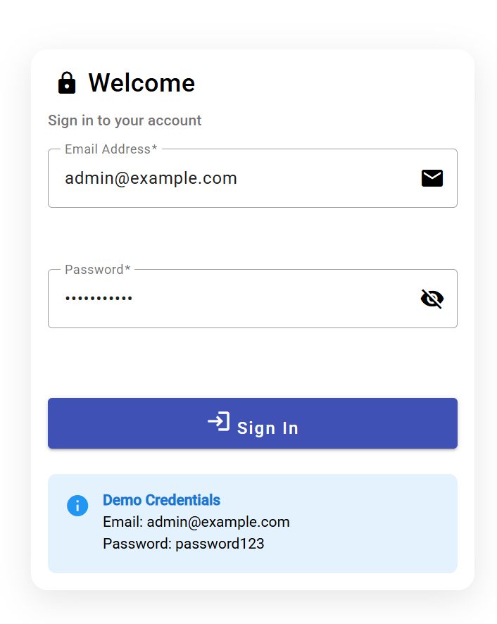
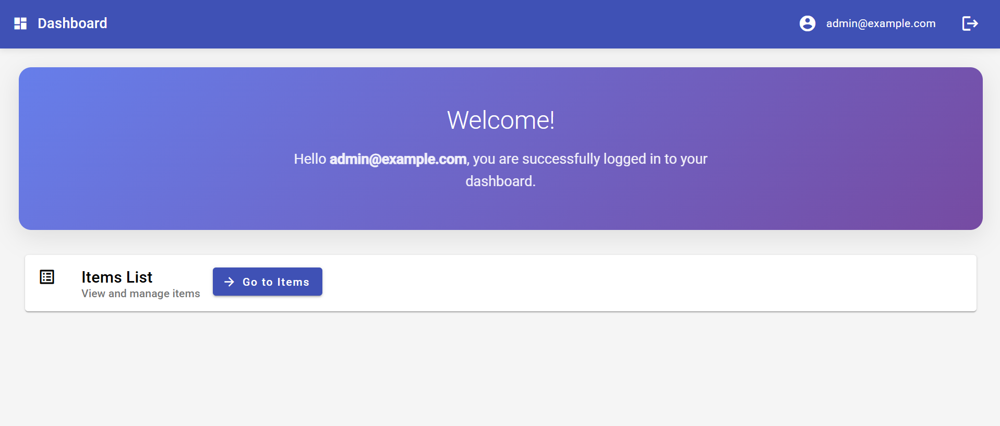
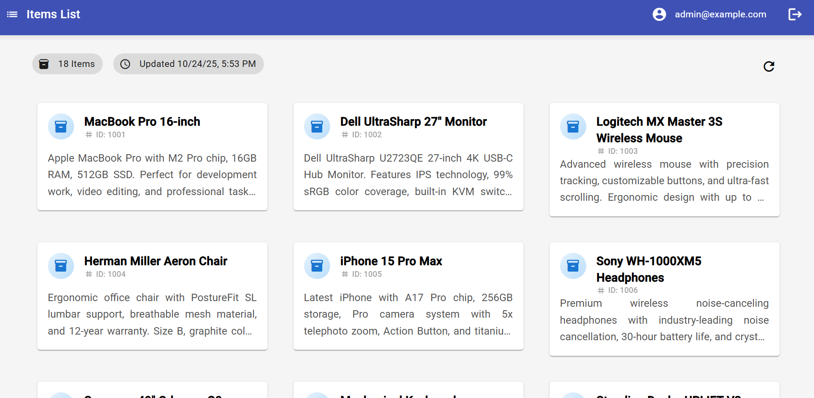

## Install packages
```bash
npm i
```


## To build the project
```bash
npm run build
```

## To run the project
```bash
npm start
```

## Demo Credentials
- **Email:** admin@example.com
- **Password:** password123

---

## Project Architecture & Approach


This project demonstrates **Angular development practices** using the latest Angular 20 features with a focus on:

- **Standalone Components** - No NgModules, fully standalone architecture
- **Angular Signals** - Modern reactive state management
- **Functional Guards** - Using `CanActivateFn` instead of class-based guards
- **HTTP Interceptors** - Functional interceptors for cross-cutting concerns
- **Lazy Loading** - Route-level code splitting for performance
- **Material Design** - UI/UX with Angular Material

---

## Project Structure

```
src/app/
├── core/                           # Singleton services & app-wide functionality
│   ├── guards/                     # Route protection (auth, guest guards)
│   ├── interceptors/               # HTTP interceptors (auth, loading, notifications, mock API)
│   ├── services/                   # Business logic services
│   │   ├── auth.service.ts         # Authentication with Angular Signals
│   │   ├── items.service.ts        # Items API service
│   │   ├── loading.service.ts      # Global loading state management
│   │   └── notification.service.ts # Global notification system
    │   ├── stores/                 # State management stores
    │   │   └── items.store.ts      # Items state with Angular Signals
│   └── models/                     # TypeScript interfaces & types
│
├── shared/                         # Reusable components & utilities
│   └── components/
│       ├── app-toolbar/            # Common toolbar component
│       └── global-loading/         # Global loading overlay
│
├── features/                       # Feature-based modules
│   │── login/                      # Login component with reactive forms
│   │── dashboard/                  # Main dashboard
│   |── list/                       # Items list with state management
│
└── app.config.ts                   # Application configuration & providers
```

---

## Key Features Demonstrated

### ** Authentication Flow**
- Login with JWT tokens
- Route protection
- Auto-logout functionality
- User session management

### ** State Management** 
- Angular Signals implementation
- Reactive computed properties
- Loading and error states
- Optimistic updates

### ** API Integration**
- RESTful API simulation
- HTTP interceptors
- Error handling
- Loading states

### ** Modern Angular Patterns**
- Standalone components
- Functional guards and interceptors
- Signal-based reactivity
- Type-safe development

---

## Screenshots

### Login page



### Dashboard Page



### Item list page



